# Dictation App Architecture Diagram

```mermaid
graph TB
    %% Main Components
    subgraph "User Interaction"
        User["User"]
        GlobalHotkey["Global Hotkey (Home)"]
        Microphone["Microphone Input"]
        CursorPosition["Cursor Position in Any App"]
    end

    subgraph "Main Process"
        MainProcess["Main Process (index.js)"]
        
        subgraph "Main Services"
            CursorService["Cursor Service (cursor.ts)"]
            AudioService["Audio Service (audio.ts)"]
            GroqService["Groq Service (groq.ts)"]
            StorageService["Storage Service (storage.ts)"]
        end
        
        subgraph "IPC Handlers"
            IPCHandlers["IPC Handlers"]
            GlobalShortcut["Global Shortcut Registration"]
            WindowManagement["Window Management"]
        end
        
        subgraph "File System"
            TempAudio["Temporary Audio File"]
            TranscriptionHistory["Transcription History"]
            SettingsStorage["Settings Storage"]
        end
    end

    subgraph "Preload"
        PreloadScript["Preload Script (preload.js)"]
        ContextBridge["Context Bridge API"]
    end

    subgraph "Renderer Process"
        RendererProcess["Renderer Process"]
        
        subgraph "React Components"
            MainWindow["Main Window (index.tsx)"]
            PopupWindow["Popup Window (popup.tsx)"]
            SettingsPanel["Settings Panel"]
            DictationPopup["Dictation Popup Component"]
        end
        
        subgraph "State Management"
            AppContext["App Context (AppContext.tsx)"]
            AudioRecordingHook["useAudioRecording Hook"]
            Settings["Settings State"]
            RecordingState["Recording State"]
            TranscriptionState["Transcription State"]
        end
    end

    subgraph "External Services"
        GroqAPI["Groq API"]
        MacOSAccessibility["macOS Accessibility APIs"]
    end

    %% Connections - User Interaction
    User -->|"Presses"| GlobalHotkey
    User -->|"Speaks into"| Microphone
    User -->|"Places cursor in"| CursorPosition

    %% Connections - Main Process
    GlobalHotkey -->|"Triggers"| GlobalShortcut
    GlobalShortcut -->|"Toggles recording"| MainProcess
    MainProcess -->|"Creates/Shows"| WindowManagement
    MainProcess -->|"Registers"| IPCHandlers
    
    %% Services Connections
    MainProcess -->|"Uses"| CursorService
    MainProcess -->|"Uses"| AudioService
    MainProcess -->|"Uses"| GroqService
    MainProcess -->|"Uses"| StorageService
    
    %% File System Connections
    AudioService -->|"Saves to"| TempAudio
    GroqService -->|"Reads from"| TempAudio
    StorageService -->|"Manages"| TranscriptionHistory
    StorageService -->|"Manages"| SettingsStorage
    
    %% Preload Connections
    MainProcess <-->|"IPC Communication"| PreloadScript
    PreloadScript -->|"Exposes API"| ContextBridge
    
    %% Renderer Connections
    ContextBridge -->|"Provides API"| RendererProcess
    RendererProcess -->|"Renders"| MainWindow
    RendererProcess -->|"Renders"| PopupWindow
    MainWindow -->|"Contains"| SettingsPanel
    PopupWindow -->|"Contains"| DictationPopup
    
    %% State Management
    RendererProcess -->|"Uses"| AppContext
    AppContext -->|"Uses"| AudioRecordingHook
    AppContext -->|"Manages"| Settings
    AppContext -->|"Manages"| RecordingState
    AppContext -->|"Manages"| TranscriptionState
    
    %% External Services
    GroqService <-->|"Transcription Requests"| GroqAPI
    CursorService -->|"Uses"| MacOSAccessibility
    GlobalShortcut -->|"Uses"| MacOSAccessibility

    %% Data Flow for Recording and Transcription
    Microphone -->|"Audio Input"| AudioRecordingHook
    AudioRecordingHook -->|"Audio Blob"| AppContext
    AppContext -->|"Save Recording"| ContextBridge
    ContextBridge -->|"IPC: save-recording"| IPCHandlers
    IPCHandlers -->|"Save Audio"| AudioService
    AudioService -->|"Audio File"| TempAudio
    IPCHandlers -->|"Transcribe Audio"| GroqService
    GroqService -->|"Audio File"| TempAudio
    GroqService <-->|"Transcription Request"| GroqAPI
    GroqService -->|"Transcription Result"| IPCHandlers
    IPCHandlers -->|"IPC: transcription-result"| ContextBridge
    ContextBridge -->|"Transcription Result"| AppContext
    AppContext -->|"Updates"| TranscriptionState
    
    %% Text Insertion Flow
    AppContext -->|"Insert Text at Cursor"| ContextBridge
    ContextBridge -->|"IPC: insert-text-at-cursor"| IPCHandlers
    IPCHandlers -->|"Insert Text"| CursorService
    CursorService -->|"Types Text at"| CursorPosition
    
    %% Settings Flow
    SettingsPanel -->|"Update Settings"| AppContext
    AppContext -->|"Save Settings"| ContextBridge
    ContextBridge -->|"IPC: save-settings"| IPCHandlers
    IPCHandlers -->|"Save Settings"| StorageService
    StorageService -->|"Writes to"| SettingsStorage
    
    %% Detailed Recording Flow
    subgraph "Recording Flow"
        direction TB
        RF1["1. User presses global hotkey"]
        RF2["2. Main process receives hotkey event"]
        RF3["3. Main process sends toggle-recording event"]
        RF4["4. Renderer starts recording"]
        RF5["5. Audio is captured"]
        RF6["6. User presses hotkey again"]
        RF7["7. Recording stops"]
        RF8["8. Audio blob sent to main process"]
        RF9["9. Audio saved to temp file"]
        RF10["10. Audio sent to Groq API"]
        RF11["11. Transcription result received"]
        RF12["12. Text saved to history"]
        RF13["13. If enabled, text inserted at cursor"]
        
        RF1 --> RF2 --> RF3 --> RF4 --> RF5 --> RF6 --> RF7 --> RF8 --> RF9 --> RF10 --> RF11 --> RF12 --> RF13
    end
    
    %% Detailed Text Insertion Flow
    subgraph "Text Insertion Flow"
        direction TB
        TI1["1. Check if insertAtCursor is enabled"]
        TI2["2. Get current mouse position"]
        TI3["3. Try direct typing with RobotJS"]
        TI4["4. If failed, try clipboard method"]
        TI5["5. Save current clipboard content"]
        TI6["6. Set clipboard to transcribed text"]
        TI7["7. Simulate Cmd+V"]
        TI8["8. Restore original clipboard content"]
        TI9["9. Restore mouse position"]
        
        TI1 --> TI2 --> TI3 --> TI4 --> TI5 --> TI6 --> TI7 --> TI8 --> TI9
    end
    
    %% Component Dependencies
    subgraph "Component Dependencies"
        direction TB
        CD1["Main Process (index.js)"]
        CD2["Preload Script (preload.js)"]
        CD3["Renderer Process (index.tsx, popup.tsx)"]
        CD4["App Context (AppContext.tsx)"]
        CD5["UI Components"]
        CD6["Services (cursor.ts, audio.ts, groq.ts, storage.ts)"]
        CD7["Shared Types and Constants"]
        
        CD7 --> CD1
        CD7 --> CD2
        CD7 --> CD3
        CD7 --> CD4
        CD7 --> CD5
        CD7 --> CD6
        CD1 --> CD6
        CD1 --> CD2
        CD2 --> CD3
        CD3 --> CD4
        CD4 --> CD5
    end
    
    %% Build Process
    subgraph "Build Process"
        direction TB
        BP1["1. compile.js runs"]
        BP2["2. Build shared modules"]
        BP3["3. Build main process services"]
        BP4["4. Process CSS with Tailwind"]
        BP5["5. Build renderer process"]
        BP6["6. Package app with Electron Forge"]
        
        BP1 --> BP2 --> BP3 --> BP4 --> BP5 --> BP6
    end
```

## Detailed Component Descriptions

### Main Process Components

- **Main Process (index.js)**
  - Core of the Electron app
  - Manages window creation and lifecycle
  - Sets up IPC handlers
  - Registers global shortcuts
  - Handles permissions

- **Cursor Service (cursor.ts)**
  - Implements text insertion at cursor position
  - Uses RobotJS for direct typing
  - Provides clipboard-based fallback method
  - Preserves mouse position during insertion

- **Audio Service (audio.ts)**
  - Manages audio recording
  - Handles audio device enumeration
  - Saves recorded audio to temporary files

- **Groq Service (groq.ts)**
  - Manages communication with Groq API
  - Handles authentication with API key
  - Sends transcription and translation requests
  - Processes API responses

- **Storage Service (storage.ts)**
  - Manages persistent storage
  - Handles saving and loading settings
  - Manages transcription history

### Renderer Process Components

- **App Context (AppContext.tsx)**
  - Central state management
  - Provides methods for recording, transcription, and text insertion
  - Manages settings and device selection
  - Handles communication with main process via IPC

- **Main Window (index.tsx)**
  - Primary UI entry point
  - Renders settings and transcription history
  - Provides controls for recording and transcription

- **Popup Window (popup.tsx)**
  - Floating UI for recording controls
  - Shows recording status
  - Allows starting/stopping recording

- **Dictation Popup Component**
  - UI component for the floating popup
  - Displays recording status and controls
  - Handles mouse events for dragging

- **Settings Panel**
  - UI for configuring app settings
  - Includes toggle for cursor insertion feature
  - Allows setting global hotkey and language preferences

### Data Flow Processes

- **Recording Flow**
  - Triggered by global hotkey
  - Captures audio from selected microphone
  - Saves audio to temporary file
  - Sends audio to Groq API for transcription
  - Updates UI with transcription result
  - Optionally inserts text at cursor position

- **Text Insertion Flow**
  - Triggered after successful transcription
  - Gets current mouse position
  - Attempts direct typing with RobotJS
  - Falls back to clipboard method if needed
  - Restores original state after insertion

- **Settings Flow**
  - User changes settings in UI
  - Settings are saved to persistent storage
  - Settings are applied to app behavior
  - Global hotkey is updated if changed

### External Dependencies

- **Groq API**
  - Provides transcription and translation services
  - Requires API key for authentication
  - Processes audio files and returns text

- **macOS Accessibility APIs**
  - Required for global hotkey functionality
  - Used for simulating keyboard input
  - Needed for system-wide overlay (popup)

## Key Interactions

1. **User → Global Hotkey → Main Process**
   - User presses global hotkey
   - Main process receives event
   - Main process toggles recording state

2. **Main Process → Renderer Process**
   - Main process sends toggle-recording event
   - Renderer process updates UI
   - Renderer process starts/stops recording

3. **Renderer Process → Main Process**
   - Renderer process sends audio data
   - Main process saves audio to file
   - Main process sends audio to Groq API

4. **Main Process → Cursor Service → User's Application**
   - Main process receives transcription
   - Cursor service inserts text at cursor position
   - Text appears in user's application 